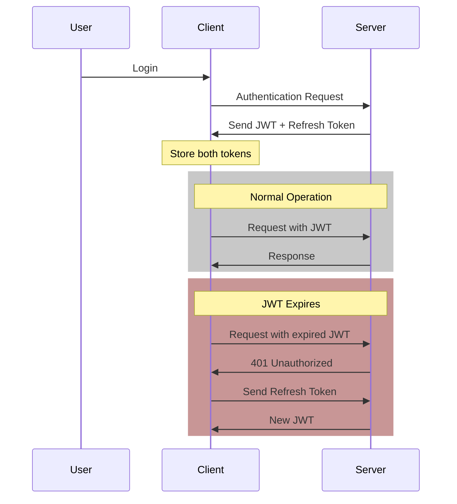
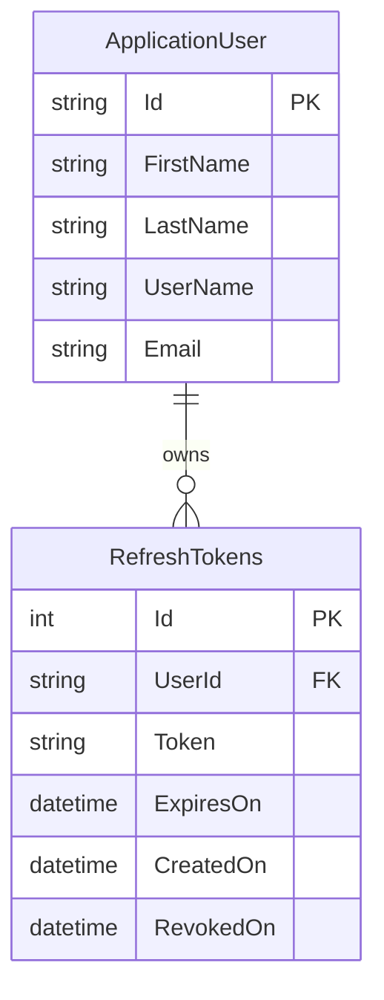
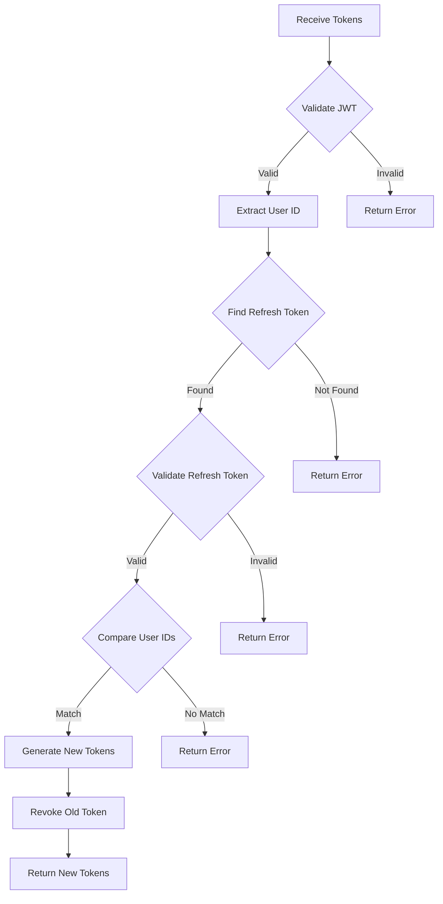
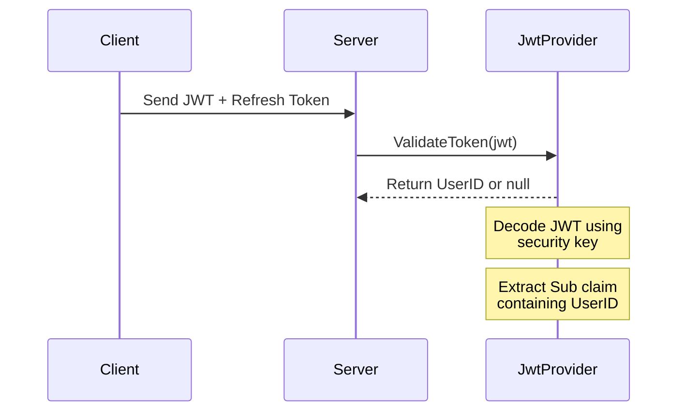
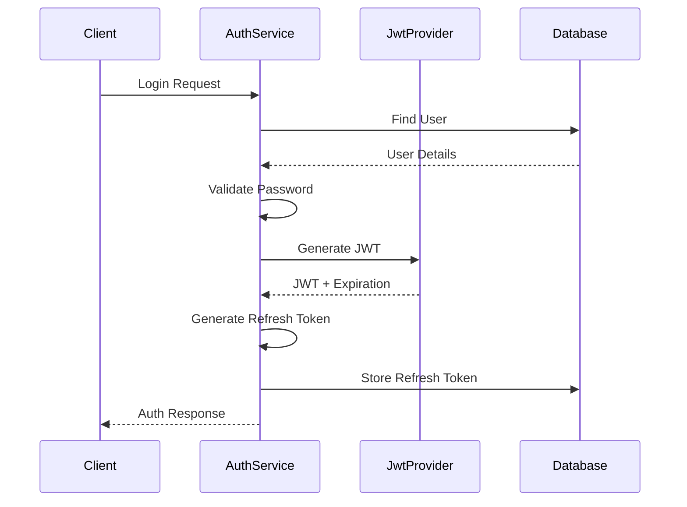
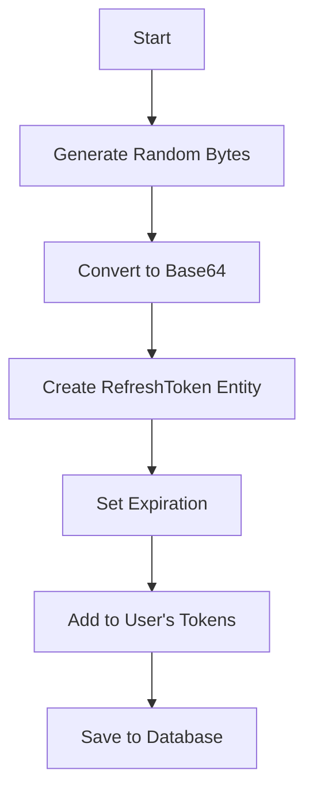
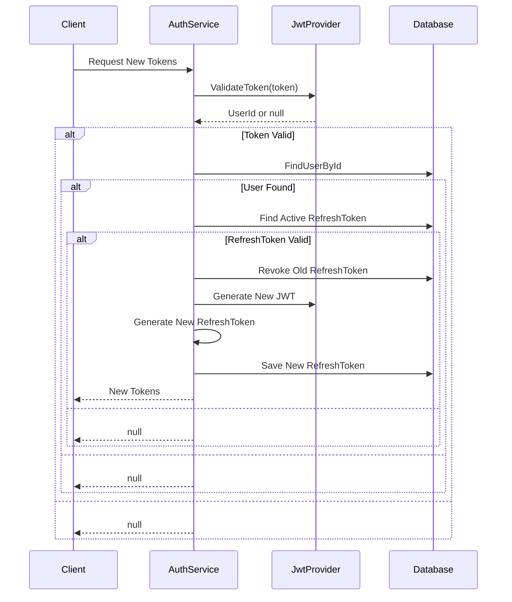
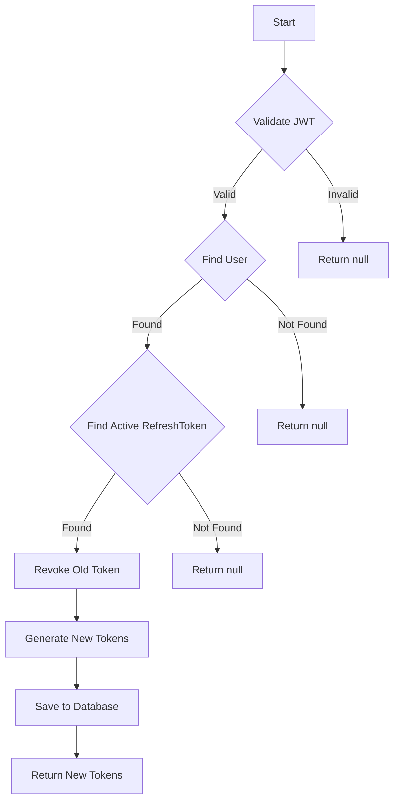
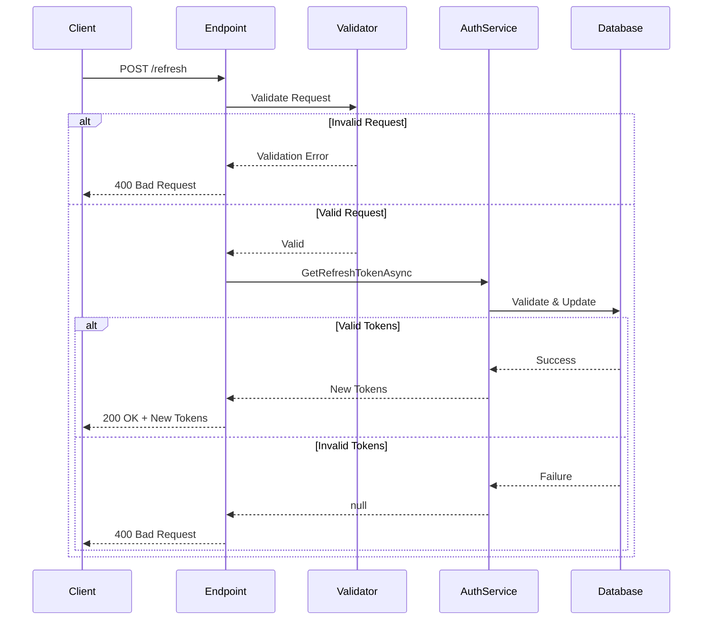

# Understanding JWT and Refresh Tokens

## Table of Contents
- [Overview](#overview)
- [JWT Token Characteristics](#jwt-token-characteristics)
- [The Need for Refresh Tokens](#the-need-for-refresh-tokens)
- [Token Flow Diagram](#token-flow-diagram)
- [Token Comparison](#token-comparison)
- [Implementation Example](#implementation-example)

## Overview
JSON Web Tokens (JWT) and refresh tokens work together to provide a secure and seamless authentication experience. While JWTs handle active authentication, refresh tokens enable automatic renewal of expired JWTs without requiring user re-authentication.

## JWT Token Characteristics

- **Limited Lifespan**: JWTs are designed to expire after a short period (typically 15-30 minutes)
- **Security Focus**: Short expiration times reduce the risk window if tokens are compromised
- **Stateless**: Can be validated without checking the database
- **Authorization Header**: Typically sent with each request as a Bearer token

## The Need for Refresh Tokens

In high-security applications like banking or financial services, short JWT lifespans are crucial. However, frequent re-authentication creates a poor user experience. Refresh tokens solve this by:

1. Providing a longer-lived token for JWT renewal
2. Operating behind the scenes without user intervention
3. Maintaining security while improving user experience

## Token Flow Diagram



## Token Comparison

| Characteristic | JWT | Refresh Token |
|---------------|-----|---------------|
| Typical Lifespan | 15-30 minutes | Days to months |
| Usage | Every API request | Only when JWT expires |
| Storage | Client-side | Secure storage |
| Purpose | Authentication & Authorization | JWT renewal |
| Size | Larger (contains claims) | Usually smaller |

## Implementation Example

When a user signs in, the server provides two key pieces of information:

1. **Access Token (JWT)**:
   ```json
   {
     "token": "eyJhbG....",
     "expiresIn": "30m"
   }
   ```

2. **Refresh Token**:
   ```json
   {
     "refreshToken": "xyz123...",
     "expiresIn": "7d"
   }
   ```

### Token Renewal Flow

1. Client detects JWT expiration
2. Instead of redirecting to login:
   - Sends refresh token to renewal endpoint
   - Receives new JWT
   - Updates stored tokens
   - Continues operation seamlessly

### Security Considerations

- Store refresh tokens securely
- Implement token rotation
- Maintain a token blacklist for revoked tokens
- Use HTTPS for all token transmission
- Implement refresh token expiration

## Real-World Example

Gmail and other Google services use this pattern to keep users signed in for extended periods while maintaining security:

- Short-lived access tokens for API requests
- Long-lived refresh tokens (stored securely)
- Automatic token renewal
- Users remain logged in for weeks/months
- Background renewal process is invisible to users

## Best Practices

1. **Token Storage**:
   - Never store in localStorage
   - Use HTTP-only cookies
   - Consider in-memory storage for JWTs

2. **Security Measures**:
   - Implement token rotation
   - Use secure transmission
   - Monitor for suspicious patterns

3. **Error Handling**:
   - Graceful expired token handling
   - Proper refresh token error responses
   - Clear user session on critical errors

4. **Performance**:
   - Implement token caching
   - Optimize renewal process
   - Monitor token usage patterns


# Implementing Refresh Token Storage in ASP.NET Core

## Table of Contents
- [Overview](#overview)
- [Database Schema Implementation](#database-schema-implementation)
  - [RefreshToken Model](#refreshtoken-model)
  - [User Model Updates](#user-model-updates)
  - [Database Configuration](#database-configuration)
- [Entity Framework Configuration](#entity-framework-configuration)
- [Database Migration](#database-migration)
- [Schema Diagram](#schema-diagram)

## Overview

Unlike JWTs which are stateless and not stored in the database, refresh tokens require persistence. This implementation guides you through setting up the necessary database schema for storing and managing refresh tokens in ASP.NET Core using Entity Framework Core.

## Database Schema Implementation

### RefreshToken Model

Create a new class `RefreshToken` in your Entities folder:

```csharp
[Owned]
public class RefreshToken
{
    public string Token { get; set; } = string.Empty;
    public DateTime ExpiresOn { get; set; }
    public DateTime CreatedOn { get; set; } = DateTime.UtcNow;
    public DateTime? RevokedOn { get; set; }
    
    // Computed properties
    public bool IsExpired => DateTime.UtcNow >= ExpiresOn;
    public bool IsActive => RevokedOn is null && !IsExpired;
}
```

Key points about the RefreshToken model:
- Marked as `[Owned]` to indicate it's an owned entity type
- Tracks creation, expiration, and revocation dates
- Includes computed properties for token status

### User Model Updates

Update the `ApplicationUser` class to include refresh tokens:

```csharp
public sealed class ApplicationUser : IdentityUser
{
    public string FirstName { get; set; } = string.Empty;
    public string LastName { get; set; } = string.Empty;
    
    // Collection of refresh tokens
    public List<RefreshToken> RefreshTokens { get; set; } = [];  // Use new() for pre-.NET 8
}
```

### Database Context

The `ApplicationDbContext` doesn't need explicit DbSet for RefreshTokens due to the owned entity configuration:

```csharp
public class ApplicationDbContext : IdentityDbContext<ApplicationUser>
{
    public ApplicationDbContext(DbContextOptions<ApplicationDbContext> options)
        : base(options)
    {
    }

    public DbSet<Poll> Polls { get; set; }

    protected override void OnModelCreating(ModelBuilder modelBuilder)
    {
        modelBuilder.ApplyConfigurationsFromAssembly(Assembly.GetExecutingAssembly());
        base.OnModelCreating(modelBuilder);
    }
}
```

## Entity Framework Configuration

Configure the refresh token relationship in `UserConfiguration`:

```csharp
public class UserConfiguration : IEntityTypeConfiguration<ApplicationUser>
{
    public void Configure(EntityTypeBuilder<ApplicationUser> builder)
    {
        builder.OwnsMany(x => x.RefreshTokens)
               .ToTable("RefreshTokens")
               .WithOwner()
               .HasForeignKey("UserId");

        builder.Property(x => x.FirstName).HasMaxLength(100);
        builder.Property(x => x.LastName).HasMaxLength(100);
    }
}
```

Key configuration points:
- Uses `OwnsMany` to establish ownership relationship
- Configures table name as "RefreshTokens"
- Sets up foreign key relationship with user

## Database Migration

Run the following commands in Package Manager Console:

```powershell
Add-Migration AddRefreshTokensTable
Update-Database
```

## Schema Diagram



## Key Features of the Implementation

1. **Composite Primary Key**:
   - Auto-generated ID (SQL Server identity)
   - User ID (foreign key from ApplicationUser)

2. **Token Management**:
   - Creation timestamp
   - Expiration tracking
   - Revocation support
   - Active status computation

3. **Relationship Structure**:
   - One-to-many relationship between User and RefreshTokens
   - Owned entity pattern for tight coupling
   - Automatic cascade delete

4. **Data Protection**:
   - Foreign key constraints
   - Proper indexing (automatically handled by EF Core)
   - Timestamp tracking for auditing

## Best Practices Implemented

1. **Entity Framework Patterns**:
   - Use of owned entity types
   - Proper relationship configuration
   - Clean separation of concerns

2. **Data Modeling**:
   - Appropriate use of nullable types
   - Default value initialization
   - Computed properties for status checks

3. **Database Design**:
   - Proper foreign key relationships
   - Table naming conventions
   - Efficient schema structure


# JWT Validation and Refresh Token Implementation

## Table of Contents
- [Overview](#overview)
- [Implementation Flow](#implementation-flow)
- [Code Implementation](#code-implementation)
  - [JWT Provider Interface](#jwt-provider-interface)
  - [JWT Provider Implementation](#jwt-provider-implementation)
- [Token Validation Process](#token-validation-process)
- [Sequence Diagram](#sequence-diagram)

## Overview

The refresh token endpoint requires two pieces of information:
1. The current JWT (expired or active)
2. The refresh token

This implementation validates both tokens and generates new ones if all security checks pass.

## Implementation Flow



## Code Implementation

### JWT Provider Interface

```csharp
public interface IJwtProvider
{
    (string token, int expiresIn) GenerateToken(ApplicationUser user);
    string? ValidateToken(string token); // Returns user ID if valid, null if invalid
}
```

### JWT Provider Implementation

```csharp
public class JwtProvider : IJwtProvider
{
    private readonly JwtOptions _options;

    public JwtProvider(IOptions<JwtOptions> options)
    {
        _options = options.Value;
    }

    public string? ValidateToken(string token)
    {
        var tokenHandler = new JwtSecurityTokenHandler();
        var symmetricSecurityKey = new SymmetricSecurityKey(
            Encoding.UTF8.GetBytes(_options.Key));
        
        try
        {
            tokenHandler.ValidateToken(
                token,
                new TokenValidationParameters
                {
                    IssuerSigningKey = symmetricSecurityKey,
                    ValidateIssuerSigningKey = true,
                    ValidateIssuer = false,
                    ValidateAudience = false,
                    ClockSkew = TimeSpan.Zero // Immediate expiration
                },
                out SecurityToken validatedToken);

            var jwtToken = (JwtSecurityToken)validatedToken;
            
            return jwtToken.Claims.First(
                x => x.Type == JwtRegisteredClaimNames.Sub).Value;
        }
        catch
        {
            return null;
        }
    }
}
```

## Token Validation Process

### 1. JWT Validation


### 2. Security Checks

The validation process performs these security checks:

| Check | Description | Failure Action |
|-------|-------------|----------------|
| JWT Signature | Validates token wasn't tampered with | Return null |
| Claims Extraction | Gets UserID from Sub claim | Return null |
| Token Expiration | Verifies using ClockSkew = Zero | Return null |

### 3. Key Implementation Details

1. **Token Handler Configuration**:
   ```csharp
   var tokenHandler = new JwtSecurityTokenHandler();
   var symmetricSecurityKey = new SymmetricSecurityKey(
       Encoding.UTF8.GetBytes(_options.Key));
   ```

2. **Validation Parameters**:
   - `ValidateIssuerSigningKey = true`: Ensures token signature validity
   - `ValidateIssuer = false`: Skips issuer validation
   - `ValidateAudience = false`: Skips audience validation
   - `ClockSkew = TimeSpan.Zero`: Immediate expiration

3. **Claims Extraction**:
   ```csharp
   jwtToken.Claims.First(x => x.Type == JwtRegisteredClaimNames.Sub).Value
   ```

## Security Considerations

1. **Token Validation**:
   - Immediate expiration enforcement
   - Cryptographic signature verification
   - Safe error handling

2. **User Identity**:
   - Extraction of user ID from claims
   - Correlation with refresh token
   - Protection against token misuse

3. **Error Handling**:
   - Graceful handling of invalid tokens
   - No sensitive information in error responses
   - Proper null handling

## Next Steps

The next implementation phases will include:
1. Refresh token validation endpoint
2. Token generation and revocation logic
3. User identity correlation
4. Database operations for refresh tokens

## Best Practices Implemented

1. **Security**:
   - Zero clock skew for precise expiration
   - Proper cryptographic key handling
   - Safe error responses

2. **Code Organization**:
   - Interface-based design
   - Dependency injection
   - Clear separation of concerns

3. **Token Handling**:
   - Proper JWT validation
   - Clean error handling
   - Secure claim extraction


# Authentication Service with Refresh Token Support

## Table of Contents
- [Overview](#overview)
- [Implementation Details](#implementation-details)
  - [Authentication Response Model](#authentication-response-model)
  - [Authentication Service](#authentication-service)
  - [Refresh Token Generation](#refresh-token-generation)
- [Process Flow](#process-flow)
- [Code Implementation](#code-implementation)

## Overview

The authentication service is updated to generate, store, and return refresh tokens alongside JWTs. This implementation includes:
- Refresh token generation and storage
- Configurable expiration periods
- Database persistence
- Enhanced authentication response

## Implementation Details

### Authentication Response Model

```csharp
public record AuthResponse(
    string Id,
    string? Email,
    string FirstName,
    string LastName,
    string Token,
    int ExpiresIn,
    string RefreshToken,
    DateTime RefreshTokenExpiration
);
```

### Code Implementation

```csharp
public class AuthService : IAuthService
{
    private readonly UserManager<ApplicationUser> _userManager;
    private readonly IJwtProvider _jwtProvider;
    private readonly int _refreshTokenExpiryDays = 14;

    public AuthService(
        UserManager<ApplicationUser> userManager,
        IJwtProvider jwtProvider)
    {
        _userManager = userManager;
        _jwtProvider = jwtProvider;
    }

    public async Task<AuthResponse?> GetTokenAsync(
        string email,
        string password,
        CancellationToken cancellationToken = default)
    {
        var user = await _userManager.FindByEmailAsync(email);
        if (user is null)
            return null;

        var isValidPassword = await _userManager.CheckPasswordAsync(user, password);
        if (!isValidPassword)
            return null;

        var (token, expiresIn) = _jwtProvider.GenerateToken(user);
        
        var refreshToken = GenerateRefreshToken();
        var refreshTokenExpiration = DateTime.UtcNow.AddDays(_refreshTokenExpiryDays);
        
        user.RefreshTokens.Add(new RefreshToken
        {
            Token = refreshToken,
            ExpiresOn = refreshTokenExpiration
        });

        await _userManager.UpdateAsync(user);

        return new AuthResponse(
            user.Id,
            user.Email,
            user.FirstName,
            user.LastName,
            token,
            expiresIn,
            refreshToken,
            refreshTokenExpiration);
    }

    private static string GenerateRefreshToken()
    {
        return Convert.ToBase64String(RandomNumberGenerator.GetBytes(64));
    }
}
```

## Process Flow



## Token Generation and Storage Process

### 1. Refresh Token Generation


### 2. Response Structure

```json
{
  "id": "user123",
  "email": "user@example.com",
  "firstName": "John",
  "lastName": "Doe",
  "token": "eyJhbGci...",
  "expiresIn": 1800,
  "refreshToken": "base64EncodedToken...",
  "refreshTokenExpiration": "2024-12-10T12:00:00Z"
}
```

## Key Features

1. **Token Generation**:
   - Cryptographically secure refresh tokens
   - 64 bytes of random data
   - Base64 encoded for safe transmission

2. **Expiration Handling**:
   - Configurable expiration period
   - UTC timestamps for consistency
   - Stored in database for validation

3. **Security Considerations**:
   - Secure random number generation
   - User-specific token storage
   - Database persistence for revocation support

## Implementation Notes

1. **Configuration**:
   ```csharp
   private readonly int _refreshTokenExpiryDays = 14;
   ```
   - Configurable refresh token lifetime
   - Can be moved to configuration file
   - Default set to 14 days

2. **Token Storage**:
   ```csharp
   user.RefreshTokens.Add(new RefreshToken
   {
       Token = refreshToken,
       ExpiresOn = refreshTokenExpiration
   });
   ```
   - Stored in user's token collection
   - Automatic relationship management
   - Easy querying and revocation

3. **Response Options**:
   - Currently returned in response body
   - Can alternatively be sent in HTTP-only cookies
   - Frontend must be aware of delivery method

## Best Practices

1. **Security**:
   - Use of cryptographically secure random numbers
   - Proper expiration handling
   - Database persistence for audit trail

2. **Architecture**:
   - Separation of concerns
   - Clean code principles
   - Proper dependency injection

3. **Data Handling**:
   - UTC timestamps
   - Proper null checking
   - Async operations

## Next Steps

1. Implement refresh token validation endpoint
2. Add token revocation functionality
3. Implement token rotation
4. Add monitoring and logging
5. Consider adding rate limiting


# Refresh Token Implementation

## Table of Contents
- [Overview](#overview)
- [Interface Definition](#interface-definition)
- [Implementation Details](#implementation-details)
- [Process Flow](#process-flow)
- [Code Implementation](#code-implementation)
- [Security Considerations](#security-considerations)

## Overview

This implementation adds refresh token functionality to the authentication service, allowing users to obtain new access tokens using their refresh tokens without re-authentication.

## Interface Definition

```csharp
public interface IAuthService
{
    Task<AuthResponse?> GetTokenAsync(
        string email, 
        string password, 
        CancellationToken cancellationToken = default);

    Task<AuthResponse?> GetRefreshTokenAsync(
        string token, 
        string refreshToken, 
        CancellationToken cancellationToken = default);
}
```

## Process Flow



## Code Implementation

```csharp
public class AuthService : IAuthService
{
    private readonly UserManager<ApplicationUser> _userManager;
    private readonly IJwtProvider _jwtProvider;
    private readonly int _refreshTokenExpiryDays = 14;

    public AuthService(
        UserManager<ApplicationUser> userManager,
        IJwtProvider jwtProvider)
    {
        _userManager = userManager;
        _jwtProvider = jwtProvider;
    }

    public async Task<AuthResponse?> GetRefreshTokenAsync(
        string token,
        string refreshToken,
        CancellationToken cancellationToken = default)
    {
        // 1. Validate JWT and extract user ID
        var userId = _jwtProvider.ValidateToken(token);
        if (userId is null)
            return null;

        // 2. Find user in database
        var user = await _userManager.FindByIdAsync(userId);
        if (user is null)
            return null;

        // 3. Validate refresh token
        var userRefreshToken = user.RefreshTokens
            .SingleOrDefault(x => x.Token == refreshToken && x.IsActive);
        if (userRefreshToken is null)
            return null;

        // 4. Revoke old refresh token
        userRefreshToken.RevokedOn = DateTime.UtcNow;

        // 5. Generate new tokens
        var (newToken, expiresIn) = _jwtProvider.GenerateToken(user);
        var newRefreshToken = GenerateRefreshToken();
        var refreshTokenExpiration = DateTime.UtcNow
            .AddDays(_refreshTokenExpiryDays);

        // 6. Save new refresh token
        user.RefreshTokens.Add(new RefreshToken
        {
            Token = newRefreshToken,
            ExpiresOn = refreshTokenExpiration
        });

        // 7. Update user in database
        await _userManager.UpdateAsync(user);

        // 8. Return new tokens
        return new AuthResponse(
            user.Id,
            user.Email,
            user.FirstName,
            user.LastName,
            newToken,
            expiresIn,
            newRefreshToken,
            refreshTokenExpiration);
    }

    private static string GenerateRefreshToken()
    {
        return Convert.ToBase64String(RandomNumberGenerator.GetBytes(64));
    }
}
```

## Validation Steps



## Security Considerations

1. **Token Validation**:
   - Validates JWT signature and expiration
   - Verifies user exists in database
   - Checks refresh token is active and matches user

2. **Token Rotation**:
   - Old refresh tokens are revoked, not deleted
   - Maintains audit trail
   - Prevents token reuse

3. **Security Checks**:
   ```csharp
   var userRefreshToken = user.RefreshTokens
       .SingleOrDefault(x => 
           x.Token == refreshToken && 
           x.IsActive);
   ```
   - Ensures token is active
   - Validates token ownership
   - Single-use refresh tokens

## Implementation Details

1. **Token States**:
   - Active: Can be used for refresh
   - Revoked: Marked with revocation timestamp
   - Expired: Based on expiration date

2. **Error Handling**:
   - Returns null for any validation failure
   - Maintains security through opacity
   - No detailed error information leaked

3. **Database Operations**:
   - Atomic updates
   - Proper relationship management
   - Audit trail maintenance

## Best Practices

1. **Token Security**:
   - Cryptographically secure token generation
   - Proper token rotation
   - Secure storage and transmission

2. **Code Organization**:
   - Clear separation of concerns
   - Proper dependency injection
   - Clean code principles

3. **Error Handling**:
   - Graceful failure handling
   - No sensitive information exposure
   - Proper null checking

## Next Steps

1. Add rate limiting for refresh token endpoints
2. Implement token blacklisting
3. Add monitoring and logging
4. Consider implementing token family concept
5. Add refresh token cleanup job

Would you like me to:
1. Add more details about token security?
2. Include additional error handling scenarios?
3. Expand the implementation examples?
4. Add more diagrams for specific flows?


# Refresh Token Endpoint Implementation

## Table of Contents
- [Overview](#overview)
- [Component Structure](#component-structure)
- [Implementation Details](#implementation-details)
  - [Data Transfer Objects](#data-transfer-objects)
  - [Validation](#validation)
  - [Controller Implementation](#controller-implementation)
- [Implementation Flow](#implementation-flow)
- [Testing Scenarios](#testing-scenarios)

## Overview

This implementation adds an endpoint for token refresh operations, including:
- Request/response DTOs
- Input validation
- Controller endpoint
- Error handling

## Component Structure

```
📁 Authentication/
├── 📁 Contracts/
│   ├── 📄 RefreshTokenRequest.cs
│   └── 📄 RefreshTokenRequestValidator.cs
└── 📄 AuthController.cs
```

## Implementation Details

### Data Transfer Objects

```csharp
public record RefreshTokenRequest(
    string Token,
    string RefreshToken
);
```

### Validation

```csharp
public class RefreshTokenRequestValidator : AbstractValidator<RefreshTokenRequest>
{
    public RefreshTokenRequestValidator()
    {
        RuleFor(x => x.Token).NotEmpty();
        RuleFor(x => x.RefreshToken).NotEmpty();
    }
}
```

### Controller Implementation

```csharp
public class AuthController : ControllerBase
{
    private readonly IAuthService _authService;

    public AuthController(IAuthService authService)
    {
        _authService = authService;
    }

    [HttpPost("")]
    public async Task<IActionResult> LoginAsync(
        LoginRequest request,
        CancellationToken cancellationToken)
    {
        var authResult = await _authService.GetTokenAsync(
            request.Email,
            request.Password,
            cancellationToken);

        return authResult is null
            ? BadRequest("Invalid Email or Password")
            : Ok(authResult);
    }

    [HttpPost("refresh")]
    public async Task<IActionResult> RefreshAsync(
        RefreshTokenRequest request,
        CancellationToken cancellationToken)
    {
        var authResult = await _authService.GetRefreshTokenAsync(
            request.Token,
            request.RefreshToken,
            cancellationToken);

        return authResult is null
            ? BadRequest("Invalid Token")
            : Ok(authResult);
    }
}
```

## Implementation Flow



## Request/Response Examples

### Request
```json
{
    "token": "eyJhbGci...",
    "refreshToken": "base64EncodedToken..."
}
```

### Success Response
```json
{
    "id": "user123",
    "email": "user@example.com",
    "firstName": "John",
    "lastName": "Doe",
    "token": "newEyJhbGci...",
    "expiresIn": 1800,
    "refreshToken": "newBase64EncodedToken...",
    "refreshTokenExpiration": "2024-12-10T12:00:00Z"
}
```

## Key Features

1. **Multiple Device Support**:
   - Single user can have multiple active refresh tokens
   - Supports login from different devices
   - Each token is tracked independently

2. **Token Rotation**:
   - Old tokens are revoked upon use
   - New tokens generated with each refresh
   - Maintains security through rotation

3. **Validation**:
   - Input validation using FluentValidation
   - Token validation in service layer
   - Proper error responses

## Security Considerations

1. **Input Validation**:
   ```csharp
   RuleFor(x => x.Token).NotEmpty();
   RuleFor(x => x.RefreshToken).NotEmpty();
   ```
   - Prevents empty or null tokens
   - Basic security validation

2. **Error Handling**:
   - Generic error messages
   - No detailed error information exposed
   - Consistent response format

3. **Token Management**:
   - Proper token rotation
   - Token revocation tracking
   - Support for multiple devices

## Best Practices

1. **Controller Design**:
   - Single responsibility
   - Clean routing
   - Proper dependency injection

2. **Validation**:
   - Separate validator class
   - Clear validation rules
   - Proper error messages

3. **Response Handling**:
   - Consistent response format
   - Proper HTTP status codes
   - Clear error messages

## Testing Scenarios

1. **Success Path**:
   - Valid tokens provided
   - New tokens generated
   - Old token revoked

2. **Failure Paths**:
   - Invalid/expired tokens
   - Missing tokens
   - Already revoked tokens

## Next Steps

1. Add rate limiting
2. Implement token blacklisting
3. Add detailed logging
4. Consider adding token metadata
5. Implement token cleanup job
