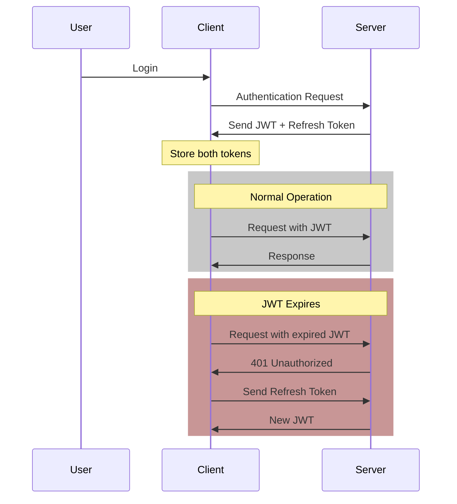
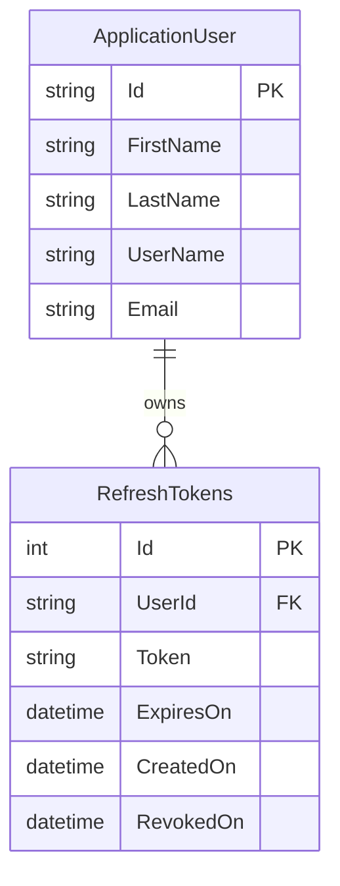

# Understanding JWT and Refresh Tokens

## Table of Contents
- [Overview](#overview)
- [JWT Token Characteristics](#jwt-token-characteristics)
- [The Need for Refresh Tokens](#the-need-for-refresh-tokens)
- [Token Flow Diagram](#token-flow-diagram)
- [Token Comparison](#token-comparison)
- [Implementation Example](#implementation-example)

## Overview
JSON Web Tokens (JWT) and refresh tokens work together to provide a secure and seamless authentication experience. While JWTs handle active authentication, refresh tokens enable automatic renewal of expired JWTs without requiring user re-authentication.

## JWT Token Characteristics

- **Limited Lifespan**: JWTs are designed to expire after a short period (typically 15-30 minutes)
- **Security Focus**: Short expiration times reduce the risk window if tokens are compromised
- **Stateless**: Can be validated without checking the database
- **Authorization Header**: Typically sent with each request as a Bearer token

## The Need for Refresh Tokens

In high-security applications like banking or financial services, short JWT lifespans are crucial. However, frequent re-authentication creates a poor user experience. Refresh tokens solve this by:

1. Providing a longer-lived token for JWT renewal
2. Operating behind the scenes without user intervention
3. Maintaining security while improving user experience

## Token Flow Diagram



## Token Comparison

| Characteristic | JWT | Refresh Token |
|---------------|-----|---------------|
| Typical Lifespan | 15-30 minutes | Days to months |
| Usage | Every API request | Only when JWT expires |
| Storage | Client-side | Secure storage |
| Purpose | Authentication & Authorization | JWT renewal |
| Size | Larger (contains claims) | Usually smaller |

## Implementation Example

When a user signs in, the server provides two key pieces of information:

1. **Access Token (JWT)**:
   ```json
   {
     "token": "eyJhbG....",
     "expiresIn": "30m"
   }
   ```

2. **Refresh Token**:
   ```json
   {
     "refreshToken": "xyz123...",
     "expiresIn": "7d"
   }
   ```

### Token Renewal Flow

1. Client detects JWT expiration
2. Instead of redirecting to login:
   - Sends refresh token to renewal endpoint
   - Receives new JWT
   - Updates stored tokens
   - Continues operation seamlessly

### Security Considerations

- Store refresh tokens securely
- Implement token rotation
- Maintain a token blacklist for revoked tokens
- Use HTTPS for all token transmission
- Implement refresh token expiration

## Real-World Example

Gmail and other Google services use this pattern to keep users signed in for extended periods while maintaining security:

- Short-lived access tokens for API requests
- Long-lived refresh tokens (stored securely)
- Automatic token renewal
- Users remain logged in for weeks/months
- Background renewal process is invisible to users

## Best Practices

1. **Token Storage**:
   - Never store in localStorage
   - Use HTTP-only cookies
   - Consider in-memory storage for JWTs

2. **Security Measures**:
   - Implement token rotation
   - Use secure transmission
   - Monitor for suspicious patterns

3. **Error Handling**:
   - Graceful expired token handling
   - Proper refresh token error responses
   - Clear user session on critical errors

4. **Performance**:
   - Implement token caching
   - Optimize renewal process
   - Monitor token usage patterns


# Implementing Refresh Token Storage in ASP.NET Core

## Table of Contents
- [Overview](#overview)
- [Database Schema Implementation](#database-schema-implementation)
  - [RefreshToken Model](#refreshtoken-model)
  - [User Model Updates](#user-model-updates)
  - [Database Configuration](#database-configuration)
- [Entity Framework Configuration](#entity-framework-configuration)
- [Database Migration](#database-migration)
- [Schema Diagram](#schema-diagram)

## Overview

Unlike JWTs which are stateless and not stored in the database, refresh tokens require persistence. This implementation guides you through setting up the necessary database schema for storing and managing refresh tokens in ASP.NET Core using Entity Framework Core.

## Database Schema Implementation

### RefreshToken Model

Create a new class `RefreshToken` in your Entities folder:

```csharp
[Owned]
public class RefreshToken
{
    public string Token { get; set; } = string.Empty;
    public DateTime ExpiresOn { get; set; }
    public DateTime CreatedOn { get; set; } = DateTime.UtcNow;
    public DateTime? RevokedOn { get; set; }
    
    // Computed properties
    public bool IsExpired => DateTime.UtcNow >= ExpiresOn;
    public bool IsActive => RevokedOn is null && !IsExpired;
}
```

Key points about the RefreshToken model:
- Marked as `[Owned]` to indicate it's an owned entity type
- Tracks creation, expiration, and revocation dates
- Includes computed properties for token status

### User Model Updates

Update the `ApplicationUser` class to include refresh tokens:

```csharp
public sealed class ApplicationUser : IdentityUser
{
    public string FirstName { get; set; } = string.Empty;
    public string LastName { get; set; } = string.Empty;
    
    // Collection of refresh tokens
    public List<RefreshToken> RefreshTokens { get; set; } = [];  // Use new() for pre-.NET 8
}
```

### Database Context

The `ApplicationDbContext` doesn't need explicit DbSet for RefreshTokens due to the owned entity configuration:

```csharp
public class ApplicationDbContext : IdentityDbContext<ApplicationUser>
{
    public ApplicationDbContext(DbContextOptions<ApplicationDbContext> options)
        : base(options)
    {
    }

    public DbSet<Poll> Polls { get; set; }

    protected override void OnModelCreating(ModelBuilder modelBuilder)
    {
        modelBuilder.ApplyConfigurationsFromAssembly(Assembly.GetExecutingAssembly());
        base.OnModelCreating(modelBuilder);
    }
}
```

## Entity Framework Configuration

Configure the refresh token relationship in `UserConfiguration`:

```csharp
public class UserConfiguration : IEntityTypeConfiguration<ApplicationUser>
{
    public void Configure(EntityTypeBuilder<ApplicationUser> builder)
    {
        builder.OwnsMany(x => x.RefreshTokens)
               .ToTable("RefreshTokens")
               .WithOwner()
               .HasForeignKey("UserId");

        builder.Property(x => x.FirstName).HasMaxLength(100);
        builder.Property(x => x.LastName).HasMaxLength(100);
    }
}
```

Key configuration points:
- Uses `OwnsMany` to establish ownership relationship
- Configures table name as "RefreshTokens"
- Sets up foreign key relationship with user

## Database Migration

Run the following commands in Package Manager Console:

```powershell
Add-Migration AddRefreshTokensTable
Update-Database
```

## Schema Diagram



## Key Features of the Implementation

1. **Composite Primary Key**:
   - Auto-generated ID (SQL Server identity)
   - User ID (foreign key from ApplicationUser)

2. **Token Management**:
   - Creation timestamp
   - Expiration tracking
   - Revocation support
   - Active status computation

3. **Relationship Structure**:
   - One-to-many relationship between User and RefreshTokens
   - Owned entity pattern for tight coupling
   - Automatic cascade delete

4. **Data Protection**:
   - Foreign key constraints
   - Proper indexing (automatically handled by EF Core)
   - Timestamp tracking for auditing

## Best Practices Implemented

1. **Entity Framework Patterns**:
   - Use of owned entity types
   - Proper relationship configuration
   - Clean separation of concerns

2. **Data Modeling**:
   - Appropriate use of nullable types
   - Default value initialization
   - Computed properties for status checks

3. **Database Design**:
   - Proper foreign key relationships
   - Table naming conventions
   - Efficient schema structure
